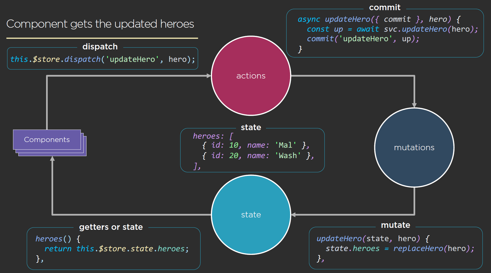

# Centralize the Data Flow with Vuex

## Types of Shared State

### Entity

- Heroes
- Villains
- Customers
- Orders

### Session

- User info
- preferences
- app settings
- UX state
- router config

### Local Class properties are still perfectly good for a class

- component

## JavaScript Modules

Component => Component =. Shared Modules

- Simplest approach
- Inject services where they are needed
- State is shared in many places, and likely implemented inconsistently

## Let’s Get Back to a Single Source of Data

## VUEX

- Vuex helps create a single source of truth for your data

### VUEX FLOW

### VUEX FLOW THIS SCENARIO

